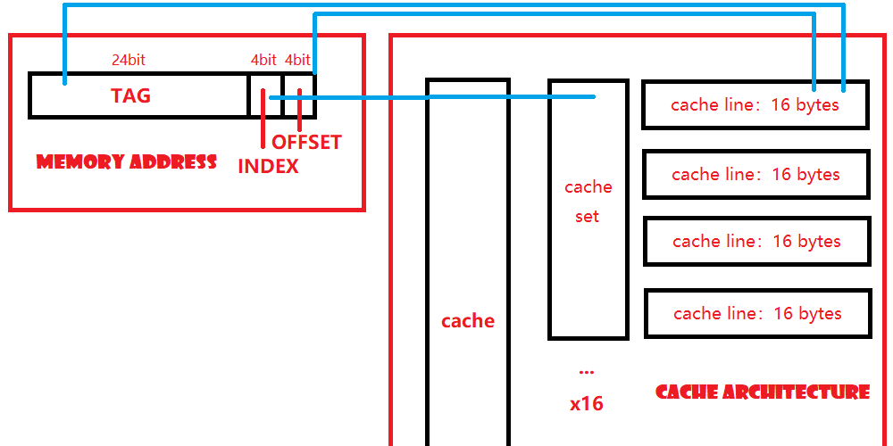

# Cache Design

A single level cache which is four-way set-associative.

## Abstract of Cache Architecture

### Cache

The top level of cache architecture is `struct cache`, the abstract of the single level cache.

Since this is a four-way set-associative cache, we can easily figure out that there are 16 sets in the cache.

```C
typedef struct cache {
    cache_set_t sets[16];       // array of sets
    unsigned int enable;        // the flag whether cache is enabled
    unsigned int access;        // cache access times
    unsigned int hit;           // cache hit times
    unsigned int miss;          // cache miss times
    unsigned int replace;       // cache line replace times
    unsigned int wb;            // cache line write back times
} cache_t;
```

### Cache Set

The second level of cache architecture is `struct cache_set`, which represents each set of cache.

As we need to implement `FIFO` replacement algorithm to replace cache line, we make it as a queue.

```C
typedef struct cache_set {
    cache_line_t *head;         // the head of the queue
    cache_line_t *tail;         // the tail of the queue
    int n;                      // the number of nodes in the queue
} cache_set_t;
```

### Cache Line

Cache line is the basic block of the cache. There are 16 bytes in each cache line. And in order to judge whether it's vaild or not, we should add other flags suce `tag`, `dirty`... to help us.

Since the cache set is a queue, the cache line is the node of this queue, there is a pointer to next cache line in this struct.

```C
typedef struct cache_line {
    unsigned int data[4];       // 16 bytes
    unsigned int tag:24;        // the tag of each cache line
    unsigned int dirty:1;       // whether the cache is dirty
    unsigned int valid:1;       // whether the cache is valid
    unsigned int ref_count;     // how many times the cache line is ref
    struct cache_line *next;    // the pointer to next cache_line
} cache_line_t;
```

### Overview

Since all instructions are based on `word` in this part, so we can simplify it by assuming all memory accesses are based on `word`.

There are four steps of memory access:

1. Divide memory address into three parts: `tag`, `index` and `offset`.
2. Find the cache set according to `index`.
3. Find the cache line by comparing the `tag`, if not found, get it from memory.
4. read word from cache line according to the `offset`.

And the graph is list below:



## FIFO Algorithm

Since we implement the FIFO algorithm, we have to implement two functions `en_cache_set` and `de_cache_set`.

`en_cache_set` helps to add cache line into cache set. The cache line will be added into the tail of queue. If there is only one element in the queue, it will also be the head. Meanwhile, `de_cache_set` helps to remove the cache line from the set, and it will free the cache line since it's useless. The head element will be removed, beacuse it is the first in element in the queue now. After that, if there is no elements left, the number of nodes in queue be will set as `0`, and both `head` and `tail` will be set as `NULL`.

```C
void en_cache_set(cache_set_t *set, cache_line_t *line) {
    if (set->tail != NULL) {
        set->tail->next = line;
    }
    set->tail = line;
    if (set->head == NULL) {
        set->head = line;
    }
    set->n += 1;
}

void de_cache_set(cache_set_t *set) {
    if (set->n == 0) {
        return;
    }
    cache_line_t *head = set->head;
    set->head = head->next;
    set->n -= 1;
    if (set->n == 0) {
        set->tail = NULL;
    }
    free(head);
}
```

## Process of Cache

There are two functions which the program will use: `cache_read` and `cache_write`. Actually both two functions are based on `cache_access`, which will access the memory and execute the function.

The `cache_access` will take four args, `cache` represents the cache, `addr` is the address of the memory, `word` is the source or destination where data is stored, and `func` represents that which function will be executed.

```C
int cache_access(cache_t *cache, md_addr_t addr, word_t *word, cache_word_func func) {
  // try to find the cache line
  // if found, execute the func
  // if not, load it from memory
  // and then exectue the func
  // return cycles
}

int cache_read(cache_t *cache, md_addr_t addr, word_t *word) {
  return cache_access(cache, addr, word, cache_word_read);
}

int cache_write(cache_t *cache, md_addr_t addr, word_t *word) {
  return cache_access(cache, addr, word, cache_word_write);
}

void cache_word_read(cache_line_t *line, word_t *dst, int offset) {
    memcpy(dst, (void *)(&line->data)+offset, sizeof(word_t));   
}

void cache_word_write(cache_line_t *line, word_t *src, int offset) {
    memcpy((void *)(&line->data)+offset, src, sizeof(word_t));
    line->dirty = 1;
}
```

If the number of cache line is equals to `SET_NUM`, the maximum  number of cache line in cache set, when we want to add new cache line into cache set, we need to use `FIFO` algorithm to replace the first one.

If the flag of `dirty` is true, we should write back this cache line first.

```C
void cache_write_back(cache_line_t *line, int index) {
  // write the cache line back
}

void add_into_cache_set(cache_set_t *set, cache_line_t *line, int index) {
  if(set->n >= SET_NUM) {
    if(set->head->dirty) {
      cache.wb++;
      cache_write_back(set->head, index);
    }
    cache.replace++;
    de_cache_set(set);
  }
  en_cache_set(set, line);
}
```

And before add new cache line which is loaded from memory, we should malloc a new buffer for it first:

```C
cache_line_t *malloc_cache_line(md_addr_t addr) {
  cache_line_t *line = malloc(sizeof(cache_line_t));
  int i;
  enum md_fault_type _fault;    
  for(i = 0; i < 4; i++) {
    line->data[i] = READ_WORD(addr+(i*4), _fault);
  }
  if(_fault != md_fault_none) {
    panic("Memory Write Error!");
  }
  line->ref_count = 0;
  line->tag = ADDR_TAG(addr);
  line->dirty = 0;
  line->valid = 1;
  line->next = NULL;
  return line;
}
```

Since we malloc a new buffer to store the data loaded from memory, and replace the old one with this new cache line, the program will access it as usual.

At last, when we finish executing our program, we must write all cache back

```C
void cache_flush(cache_t* cache) {
  cache_set_t *set;
  cache_line_t *line;
  int i;
  for(i = 0; i < 16; i++) {
    set = &cache->sets[i];
    for(line = set->head; line != NULL; line = line->next) {
      if(line->dirty) {
        cache_write_back(line, i);
      }
    }
  }
}
```
