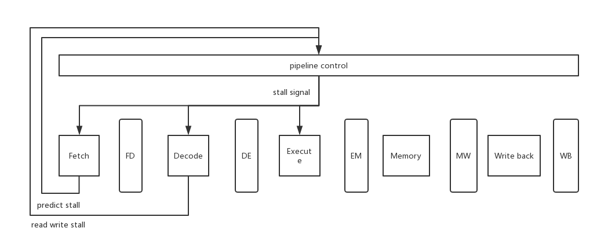
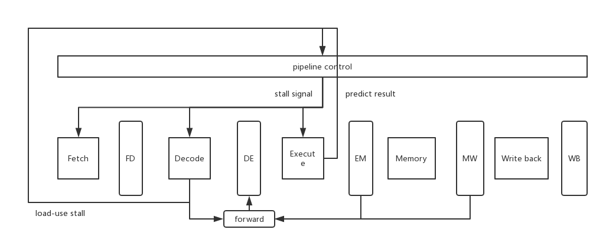

# Part2

In this part, we will design two versions of pipeline cpu: one with stall and another one with data forward.

## Inst list

All instructions we should implement in `loop` are listed: 

[inst list](./inst_list.md)

## Basic pipeline stage

There are classic five pipeline stages:

1. `IF`: fetch instruction from memory based on PC+4 for non-branch instruction, or based on the PC
provided by branch resolution for branch instruction.
2. `ID`: decode instruct, detect data /control hazard, read register for operands.
3. `EX`: execute computation operations (ALU/others), calculate effective memory address for load/store
instructions, resolve branches.
4. `MEM`: load/store data from/to memory address calculated in EX stage.
5. `WB`: write data back to register file and finish the instruction. 

And in `sim-pipe.h`, we define the data structure as below:

- `fd`
```C
struct ifid_buf {
  md_inst_t inst;       /* instruction that has been fetched */
  md_addr_t PC;         /* pc value of current instruction */
  md_addr_t NPC;        /* the next instruction to fetch */
};
```

- `de`
```C
struct idex_buf {
  md_inst_t inst;       /* instruction in ID stage */ 
  md_addr_t PC;         /* pc value of current instruction */
  int opcode;           /* operation number */
  oprand_t oprand;      /* operand */
  int instFlags;        /* inst flag */
  int func;             /* alu func code */
  int srcA;             /* alu srcA */
  int srcB;             /* alu srcB */
  int aluA;             /* alu valA */
  int aluB;             /* alu valB */
  int valA;
  int dstE;
  int dstM;
  int rw;               /* read/write flag */
  int target;           /* de jump target */
};
```

- `em`
```C
struct exmem_buf{
  md_inst_t inst;       /* instruction in EX stage */
  md_addr_t PC;         /* pc value of current instruction */
  int valE;             /* alu result */
  int valA;
  int dstE;
  int dstM;
  int rw;               /* read/write flag */
  int target;           /* em jump target */
};
```

- `mw`
```C
struct memwb_buf{
  md_inst_t inst;       /* instruction in MEM stage */
  md_addr_t PC;         /* pc value of current instruction */
  int valE;             /* alu result */
  int valM;             /* val read from mem */
  int dstE;
  int dstM;
  int rw;               /* read/write flag */ 
};
```

- `wb`
```C
struct wb_buf{
  md_inst_t inst;       /* instruction in WB stage */
  md_addr_t PC;         /* pc value of current instruction */
  int valE;  
  int valM;
  int dstE;
  int dstM;
};
```

As for control signal, we should design a new data structure:

- `ctl`
```C
struct control_buf {
  int flag;
  int cond;
  int regs;
  int stall;
};
```

## Pipeline with stall

By using stalling, we can deal with data hazard and control hazard by stalling pipeline stages.

### Data hazard

```
lui $29,32767       // instruction a
addu $30,$0,$29     // instruction b
```

You will find the instruction b relies on the result of instruction a, so in order to wait the value of `$29`, we need to insert `nop` until `lui` reaches the write back stage.

if      | id      | ex      | mem      |  wb
--------|---------|---------|----------|--------
**lui** | nop | nop | nop | nop
**addu** | **lui** | nop | nop | nop
nop | **addu** | **lui** | nop | nop
nop | **addu** | nop | **lui** | nop
nop | **addu** | nop | nop | **lui**
nop | nop | **addu** | nop | nop

### Control hazard

```
bne $3,$0,400110 <__start+0x40>
j 400158 <__start+0x88>
addu $4,$0,$2
```

Until `bne` reaches execute stage, we will know which instruction we should fetch, so we need to insert a `nop` instruction.

if      | id      | ex      | mem      |  wb
--------|---------|---------|----------|--------
**bne** | nop | nop | nop | nop
**j** | **bne** | nop | nop | nop
**addu** | nop | **bne** | nop | nop
nop | **addu** | nop | **bne** | nop
nop | nop | **addu** | nop | **bne**

### Design

The design is simply illustrated like this:

  

### Trace

[trace-withstall.txt](./trace-withstall.txt)

## Pipeline without stall

By using stalling, we can deal with data hazard and control hazard by data forwarding and predicting. As we have to use stalling to deal with `load-use` hazard.

### Data hazard

As for data hazard, we can deal with all data hazard except `load-use` hazard.

if      | id      | ex      | mem      |  wb
--------|---------|---------|----------|--------
**lw** | nop | nop | nop | nop
**addiu** | **lw** | nop | nop | nop
**addu** | **addiu** | **lw** | nop | nop
**addu** | **addiu** | **nop** | **lw** | nop
**sw** | **addu** | **addiu** | **nop** | **lw**

Others will be forwarded by our program:

```C
void forward(int *val, int *src) {
  if(*src != DNA) {
    if(*src == em.dstE) {
      *val = em.valE;
    } else if(*src == mw.dstE) {
      *val = mw.valE;      
    } else if(*src == mw.dstM) {
      *val = mw.valM;      
    } else if(*src == wb.dstE) {
      *val = wb.valE;            
    } else if(*src == wb.dstM) {
      *val = wb.valM;      
    } else {
      *val = GPR(*src);      
    }
  } else {
    *val = 0;
  }
}
```

### Control hazard

```
bne $3,$0,400110 <__start+0x40>
j 400158 <__start+0x88>
addu $4,$0,$2
```

Using  the strategy of "branch not taken", we need to fix error if we predict wrongly. As a result, we lose one cycle.

if      | id      | ex      | mem      |  wb
--------|---------|---------|----------|--------
**bne** | nop | nop | nop | nop
**j** | **bne** | nop | nop | nop
**addu** | **j** | **bne** | nop | nop
**sll** | **addu** | **j** | **bne** | nop
**addiu** | **sll** | **addu** | **j** | **bne**

### Design

The design is simply illustrated like this:



### Trace

[trace.txt](./trace.txt)

## Dir structure

* `inst_list.md` instructions list
* `README.md` readme
* `sim-pipe.c` sim-pipe source file
* `sim-pipe.h` sim-pipe header file
* `sim-pipe-withstall.c` sim-pipe with stall
* `trace.txt` trace log
* `trace-withstall.txt` trace-withstall log

## How to run

```shell
# $IDIR is the path of your actual SimpleScalar directory
## make target program --- loop
$IDIR/bin/sslittle-na-sstrix-as -o loop.o loop.s
$IDIR/bin/sslittle-na-sstrix-ld -o loop loop.o
## replace loader.c in target-pisa dir
cp loader.c $IDIR/simplesim-3.0/target-pisa/
## replace Makefile
cp Makefile $IDIR/simplesim-3.0/
## make
make clean
make config-pisa
make sim-pipe
## run
sim-pipe loop
```